# Bibliothèque de prompts Grok Imagine 1.5 — Français

[English](README.md) · [简体中文](README.zh-CN.md) · [繁體中文](README.zh-TW.md) · [日本語](README.ja-JP.md) · [한국어](README.ko-KR.md) · [Español](README.es-ES.md) · [Français](README.fr-FR.md) · [Deutsch](README.de-DE.md) · [Português](README.pt-BR.md) · [Italiano](README.it-IT.md) · [Русский](README.ru-RU.md) · [العربية](README.ar.md) · [Bahasa Indonesia](README.id-ID.md) · [ไทย](README.th-TH.md) · [Tiếng Việt](README.vi-VN.md)

> 65 prompts, dont 11 exemples illustrés disponibles en 15 langues. Parcourez les catégories et copiez les prompts complets.

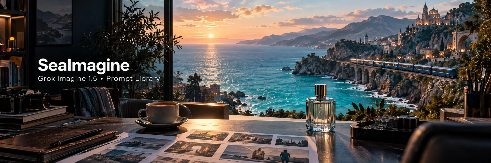

<a id="find-the-right-prompt"></a>

<a id="prompt-library"></a>

## Index des catégories

[Parcourir d’autres prompts (en anglais) · 65](docs/PROMPT_INDEX.md)

| Catégorie | Scènes | Modes | Exemples |
| --- | --- | --- | --- |
| [Produits et publicité · 8](docs/PROMPT_INDEX.md#01-ads-and-products) | Macros de soins / café / bijoux / publicités pour applications | Texte vers vidéo / Image vers vidéo / Références vers vidéo | [Bouteille en verre marin : comparer des mouvements maîtrisés](#case-sea-glass-bottle) · [Halo d’agrumes : film de parfum haut de gamme](#case-citrus-halo) |
| [Récits cinématographiques · 7](docs/PROMPT_INDEX.md#02-cinematic-storytelling) | Action / romance / suspense / science-fiction / animation | Texte vers vidéo / Image vers vidéo / Prolongement vidéo | [Itinéraire bleu : suivi d’un livreur dans un marché pluvieux](#case-blue-route) |
| [Réseaux sociaux et quotidien · 8](docs/PROMPT_INDEX.md#03-social-ugc) | Retours d’expérience / cuisine / fitness / entretiens | Texte vers vidéo / Image vers vidéo / Références vers vidéo | [Première gorgée : avis authentique d’une créatrice au café](#case-first-sip) · [La ligne du sel à l’aube : documentaire de voyage](#case-salt-line) |
| [Personnages et dialogues · 7](docs/PROMPT_INDEX.md#04-characters-and-references) | Personnages / costumes / dialogues / scènes de groupe | Références vers vidéo / Image vers vidéo | [La dernière dent — duo d’horlogers](#case-clockwork-dialogue) |
| [Transformations visuelles et prolongements · 7](docs/PROMPT_INDEX.md#05-editing-and-extension) | Changement de météo / nettoyage / changement de style / prolongement | Montage vidéo / Prolongement vidéo / Image vers vidéo | [La pluie gagne la galerie — changement de temps continu](#case-rainlit-arcade) |
| [Matières et sons satisfaisants · 7](docs/PROMPT_INDEX.md#07-satisfying-materials) | Sable pressé / feuille de cuivre / gouttes d’eau / marbrure | Texte vers vidéo / Image vers vidéo | [Verger d’ambre — une seule tranche translucide](#case-amber-orchard) |
| [Espaces et architecture · 7](docs/PROMPT_INDEX.md#08-spaces-and-transformations) | Meubles dépliants / cours intérieures / maisons en coupe | Texte vers vidéo / Image vers vidéo | [L’atrium s’ouvre — révélation d’une serre mécanique](#case-unfolding-atrium) |
| [Miniatures et surréalisme · 7](docs/PROMPT_INDEX.md#09-miniature-and-surreal) | Ferrys dans des tasses / pluie dans un tiroir / lunes en papier | Texte vers vidéo / Image vers vidéo | [Le pain au miel : histoire de boulangerie miniature](#case-honey-loaf) |
| [Mode et performance · 7](docs/PROMPT_INDEX.md#10-fashion-and-performance) | Jupes en mouvement / capes / projections sur un col / pas de danse | Texte vers vidéo / Image vers vidéo | [Orbite cobalt — étude de mode sur un tour complet](#case-cobalt-orbit) |

[Exemples illustrés](#featured-prompts) · [Créer avec SeaImagine](#create-with-seaimagine)

<a id="visual-index"></a>

<a id="featured-prompts"></a>

## Des prompts illustrés à copier et à adapter

Parcourez 11 exemples illustrés, copiez un prompt et adaptez le plan.

<a id="case-sea-glass-bottle"></a>

<a id="seaimagine-sea-glass-bottle"></a>

### 1. Bouteille en verre marin : comparer des mouvements maîtrisés


**Réglages image vers vidéo:** 5s · 16:9 · 720p · [Image de départ : ouvrir et enregistrer](assets/seaimagine-sea-glass-bottle.webp) · [TXT](prompts/text/fr-FR/sea-glass-bottle.txt)

```text
Conservez l’unique bouteille en verre marin dépoli sur la pierre claire, son bouchon cylindrique, sa face avant vierge sans inscription, le niveau d’eau, l’horizon et l’éclairage latéral doux. La bouteille ne bouge jamais.
Pendant cinq secondes, effectuez un lent déplacement latéral de la caméra vers la droite, sur une distance ne dépassant pas la largeur d’une bouteille.
Une petite goutte d’eau descend sur la face avant et s’arrête à la base. À l’arrière-plan, les vagues se déplacent doucement dans le flou. Gardez des reflets cohérents avec la caméra et la source lumineuse.
Son : uniquement le ressac lointain ; ni musique, voix, choc de verre ou éclaboussures exagérées.
Ni coupe ni zoom. Préservez la silhouette de la bouteille, l’alignement du bouchon, la texture du verre et le nombre d’objets.
Évitez les logos générés, les changements du niveau de liquide, les bords déformés, les objets flottants ou les nouveaux accessoires.
Gardez un cadre stable pendant la dernière seconde.
```

[Retour à l’index des catégories](#find-the-right-prompt)

<a id="case-blue-route"></a>

<a id="3-blue-route--rain-market-courier-tracking-shot"></a>

### 2. Itinéraire bleu : suivi d’un livreur dans un marché pluvieux

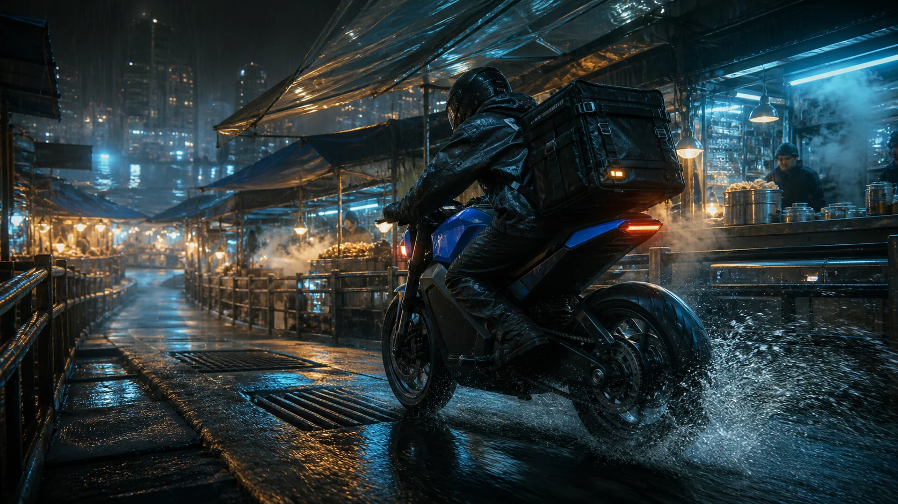

**Réglages image vers vidéo:** 10s · 16:9 · 1080p · [Image de départ : ouvrir et enregistrer](assets/rainy-market-courier-video.webp) · [TXT](prompts/text/fr-FR/blue-route.txt)

```text
Préservez le livreur, la moto électrique cobalt, le coffre de livraison, le marché surélevé, les auvents translucides, la passerelle en acier mouillée, l’éclairage et la palette nocturne fournis. Créez un seul travelling bas et continu, ancré dans le réel, avec masse, adhérence, pluie et suspension crédibles.

0–3s : la moto accélère doucement depuis sa position initiale. Le pneu arrière projette un fin éventail d’eau ; la suspension se comprime sur un joint de drainage. La caméra suit à côté et légèrement derrière, à hauteur de roue, à la même vitesse et sans secousses violentes.

3–7s : le livreur s’incline dans une large courbe à gauche. Les auvents plient dans le vent, la vapeur sort des étals et les lumières chaudes du décor s’étirent doucement dans les reflets mouillés. Gardez les deux roues rondes et en contact avec le sol.

7–10s : la moto se redresse et rejoint une partie ouverte plus lumineuse du marché. La caméra recule d’un demi-mètre pour révéler le chemin, puis maintient un cadre final stable.

Son : sifflement réaliste du moteur électrique, projections d’eau, pluie sur les auvents, voix discrètes du marché, un choc de suspension. Ni musique, dialogue, sirènes ou explosions.

Continuité : tenue exacte, casque, géométrie de la moto, coffre, panneaux bleus et disposition du marché. Ni transformation du véhicule, roues déformées, collisions, armes, panneaux lisibles, logos, téléportation de caméra ou accélération impossible.
```

[Retour à l’index des catégories](#find-the-right-prompt)

<a id="case-honey-loaf"></a>

<a id="4-the-honey-loaf--miniature-bakery-story"></a>

### 3. Le pain au miel : histoire de boulangerie miniature

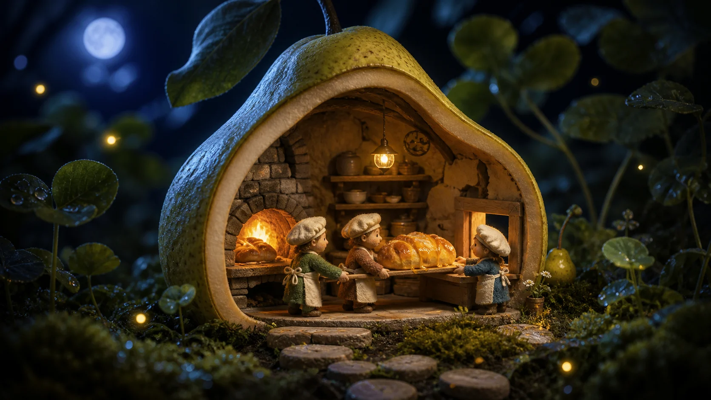

**Réglages image vers vidéo:** 9s · 16:9 · 1080p · [Image de départ : ouvrir et enregistrer](assets/pear-bakery-miniature-video.webp) · [TXT](prompts/text/fr-FR/honey-loaf.txt)

```text
Conservez la boulangerie en forme de poire, les trois boulangers miniatures, costumes, visages, pain au miel, four, fenêtre, mousse, trèfle, lune, matières tactiles du stop motion et contraste chaud-froid.

0–3s : partez de la composition large fournie, avec un rythme discret de stop motion artisanal. Deux boulangers soulèvent ensemble le pain chaud ; leurs mains restent au contact de la planche en bois. Un petit nuage de farine monte, le feu du four vacille et le troisième boulanger ouvre le guichet de service.

3–7s : les deux font quatre pas prudents et synchronisés vers le guichet. Le pain a un poids crédible et s’abaisse légèrement entre eux. Dehors, une feuille de trèfle libère une goutte de rosée et deux lucioles passent à différentes profondeurs. La caméra décrit un arc doux de cinq degrés vers la droite.

7–9s : ils glissent la planche sur le comptoir, échangent des sourires soulagés et la lueur du four se stabilise. Terminez avec les trois personnages visibles et le pain au centre.

Son : petits pas sur le bois, léger crépitement du four, grincement de planche, discrets insectes nocturnes, une petite clochette au guichet. Ni dialogue, narration, musique ou texte.

Continuité : préservez le nombre de personnages, leurs visages, l’échelle, les couleurs des tenues, la forme de poire, la disposition intérieure et la texture artisanale. Ni boulangers supplémentaires, images 3D brillantes, membres en caoutchouc, accessoires flottants, pain fondant, coupes, logos ou personnages ressemblant à ceux de franchises.
```

[Retour à l’index des catégories](#find-the-right-prompt)

<a id="case-clockwork-dialogue"></a>

<a id="seaimagine-clockwork-dialogue"></a>

### 4. La dernière dent — duo d’horlogers

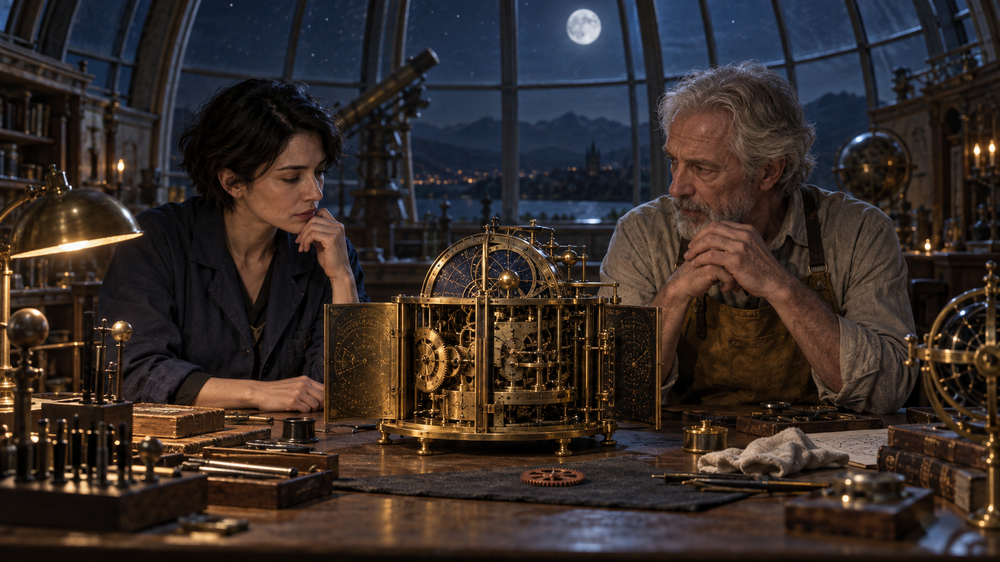

**Réglages image vers vidéo:** 10s · 16:9 · 720p · [Image de départ : ouvrir et enregistrer](assets/clockwork-dialogue.png) · [TXT](prompts/text/fr-FR/clockwork-dialogue.txt)

```text
Anime cette référence en une scène de cinéma sobre de dix secondes. Conserve les deux restaurateurs adultes, l’horloge astronomique en laiton ouverte, l’unique engrenage libre et l’observatoire au clair de lune. La femme aux cheveux courts en tenue bleu marine reste à gauche ; l’homme grisonnant au tablier ocre, à droite. Cadre-les à mi-corps derrière l’établi.

0–3s: plan à deux avec avancée presque imperceptible. Elle examine l’horloge et demande doucement en français : « Elle sera à l’heure ? » Il regarde le mécanisme. Seule elle parle, lèvres synchronisées. L’horloge bat déjà lentement ; l’échappement visible oscille régulièrement.

3–7s: il écoute attentivement l’horloge, mains détendues et immobiles. L’engrenage reste fixe sur la table ; personne ne le touche. Après une courte pause il répond en français : « Maintenant, oui. » Seules ses lèvres bougent. Horloge et échappement conservent le même rythme lent.

7–10s: elle passe du cadran à son visage et esquisse un sourire soulagé. Il croise son regard. Termine sur leur silence partagé, l’horloge battant entre eux et la lune froide dessinant leurs épaules.

Audio : voix proches et sèches, tic-tac fin et lent dès la première image dans la pièce résonnante. Ni musique, voix superposées ou bruit d’engrenage déplacé.

L’engrenage reste séparé et immobile ; personne ne le monte. Préserve mains, mécanisme, vêtements, regards et positions gauche/droite. Aucun démarrage par un geste, outil ou engrenage supplémentaire, sous-titre, coupe ou geste exagéré.
```

[Retour à l’index des catégories](#find-the-right-prompt)

<a id="case-first-sip"></a>

<a id="2-first-sip--authentic-café-ugc-review"></a>

### 5. Première gorgée : avis authentique d’une créatrice au café

<a href="assets/cozy-cafe-ugc-video.webp">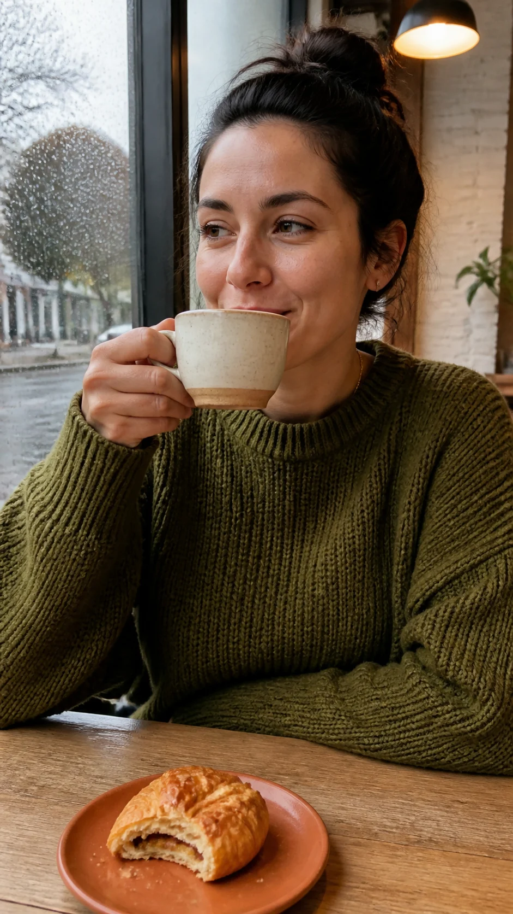</a>

**Réglages image vers vidéo:** 10s · 9:16 · 1080p · [Image de départ : ouvrir et enregistrer](assets/cozy-cafe-ugc-video.webp) · [TXT](prompts/text/fr-FR/first-sip.txt)

```text
Animez la photo de café fournie comme un avis sincère de créatrice filmé caméra à la main. Préservez son visage, son âge, sa texture de peau, ses cheveux, son pull vert mousse, la tasse, la pâtisserie, la fenêtre et la disposition de la table.

0–3s : léger flottement naturel de caméra à la main. Elle finit une gorgée, baisse la tasse en céramique d’environ dix centimètres, expire avec un petit sourire et détourne le regard de la fenêtre vers la caméra. La vapeur monte en volutes et les traînées de pluie se rejoignent lentement sur la vitre derrière elle.

3–8s : elle dit, en français naturel et d’une voix détendue : « Crémeux, pas trop sucré… et on sent vraiment l’avoine. » Gardez un ton spontané, avec une toute petite pause après « sucré ». Synchronisez précisément les lèvres et gardez la tasse stable dans sa main.

8–10s : elle acquiesce légèrement et regarde la pâtisserie tandis que la caméra se stabilise.

Son : voix proche enregistrée au téléphone, ambiance calme de café, buse à vapeur lointaine, pluie douce, contact de la tasse en céramique. La voix reste devant, l’ambiance discrète. Ni musique de fond ni sous-titres.

Continuité : ni embellissement du visage, changement de tenue, doigts supplémentaires, modification de la tasse ou des aliments, apparition de personnes au fond, logos ou gestes exagérés d’influenceuse.
```

[Retour à l’index des catégories](#find-the-right-prompt)

<a id="case-salt-line"></a>

<a id="5-salt-line-at-dawn--travel-documentary"></a>

### 6. La ligne du sel à l’aube : documentaire de voyage

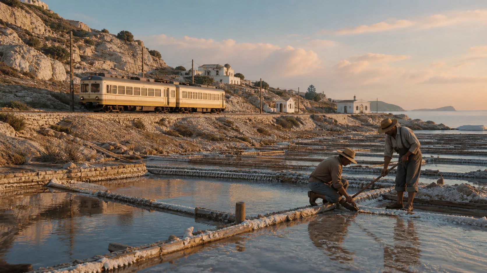

**Réglages image vers vidéo:** 12s · 16:9 · 1080p · [Image de départ : ouvrir et enregistrer](assets/coastal-salt-train-documentary.webp) · [TXT](prompts/text/fr-FR/salt-line.txt)

```text
Animez la scène côtière de marais salants fournie comme un documentaire de voyage d’observation respectueux. Préservez les deux ouvriers, le train crème et ocre, les bassins, les collines calcaires, bâtiments, mer, direction du lever du soleil et palette de film atténuée.

0–4s : plan large fixe. Les ouvriers inspectent le canal : l’un guide un outil en bois dans la saumure peu profonde, l’autre maintient la séparation. L’eau ondule en réaction à l’outil et à la brise matinale. Le train approche à vitesse mesurée au second plan.

4–9s : la caméra panoramique lentement à droite pour suivre le train. Les roues restent alignées sur les rails ; l’espacement des voitures et le rythme des fenêtres restent constants. Un léger voile de brume marine dérive derrière lui, tandis que le soleil éclaire progressivement les cristaux de sel au premier plan.

9–12s : le train poursuit vers la côte et le panoramique s’arrête en douceur. Un ouvrier se redresse, s’étire naturellement et regarde la voie. Maintenez les deux dernières secondes pour un point de montage.

Son : doux bourdonnement électrique du train, rythme des roues aux joints, brise sur l’eau peu profonde, mouettes lointaines, outil en bois dans la saumure. Ni narration, musique, foule ou klaxon dramatique.

Continuité : travail réaliste, anatomie stable, paysage fixe, train inchangé, reflets et physique de l’eau plausibles. Ni silhouette urbaine moderne, mise en scène touristique, nouveaux bâtiments, logos, panneaux lisibles, couleurs de carte postale saturées ou ciel en accéléré.
```

[Retour à l’index des catégories](#find-the-right-prompt)

<a id="case-rainlit-arcade"></a>

<a id="seaimagine-rainlit-arcade"></a>

### 7. La pluie gagne la galerie — changement de temps continu

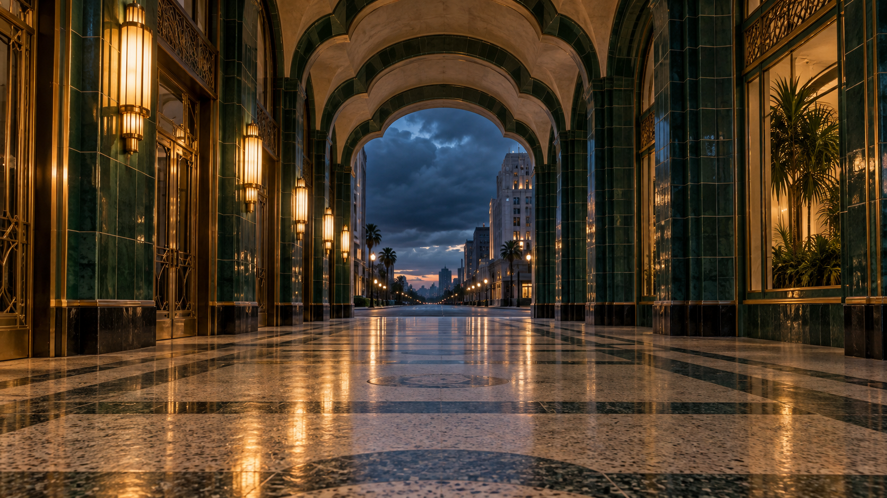

**Réglages image vers vidéo:** 10s · 16:9 · 720p · [Image de départ : ouvrir et enregistrer](assets/rainlit-arcade.png) · [TXT](prompts/text/fr-FR/rainlit-arcade.txt)

```text
Prends la galerie Art déco vide comme première image exacte d’une étude météorologique de dix secondes. Garde carreaux vert profond, laiton, terrazzo, arches répétées et appliques chaudes à gauche. L’ouverture lointaine sur la rue reste bleue au crépuscule. Tout le sol intérieur commence sec ; la caméra regarde la sortie depuis la galerie.

0–3s: composition architecturale fixe, sans panoramique ni zoom. Au-delà du seuil lointain, une rafale chasse la pluie en diagonale dans la rue. Les premières gouttes entrent et ne foncent que le terrazzo au bord du seuil. Le premier plan reste parfaitement sec.

3–7s: la rafale forcit, poussant la pluie fine plus loin dans la même direction. Un front humide irrégulier progresse du fond vers le milieu ; les gouttes rejoignent visiblement les taches existantes. De petites flaques peu profondes se forment. Conserve les reflets doux déjà présents sur le sol sec poli ; dans les zones mouillées, la pluie les fragmente en traînées chaudes ondulantes.

7–10s: une dernière nappe de bruine atteint le milieu proche et ralentit. La bande la plus proche reste sèche. La pluie faiblit ; les cercles superposés diminuent dans les flaques et les reflets se stabilisent. Garde les arches inchangées devant l’ouverture bleue.

Audio : pluie extérieure, puis impacts sur pierre de plus en plus proches, une rafale sourde et un écho léger. Ni tonnerre, musique ou voix.

L’eau suit un chemin continu visible : aucun brillant instantané sur tout le sol, aucune flaque devant le front humide. Eau peu profonde, lampes stables, caméra horizontale, lignes architecturales rigides. Ni personnes, plantes ajoutées, nouvelles enseignes, éclairs, inondation, coupes ou surfaces remodelées.
```

[Retour à l’index des catégories](#find-the-right-prompt)

<a id="case-amber-orchard"></a>

<a id="seaimagine-amber-orchard"></a>

### 8. Verger d’ambre — une seule tranche translucide

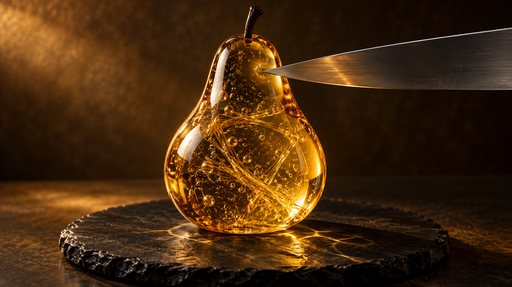

**Réglages image vers vidéo:** 10s · 16:9 · 720p · [Image de départ : ouvrir et enregistrer](assets/amber-orchard.png) · [TXT](prompts/text/fr-FR/amber-orchard.txt)

```text
Crée un gros plan de matière surréaliste de dix secondes. Préserve la poire en verre ambré transparent sur son assiette de pierre noire, ses bulles piégées et fines fibres dorées. Un seul couteau étroit entre par la droite ; sa pointe touche déjà le flanc droit de la poire. Aucun visage ni main. C’est un verre imaginaire rigide que l’on peut trancher proprement : matière impossible assumée, géométrie cohérente.

0–3s: macro fixe de trois quarts, poire et assiette entières. Lumière latérale chaude sur les fibres. Retire d’abord le couteau de son contact actuel, relève-le au-dessus du flanc droit, puis aligne-le pour une coupe verticale retirant une fine tranche externe, pédoncule sur le grand corps.

3–7s: une seule descente ininterrompue. La lame traverse le flanc jusqu’à effleurer l’assiette. Un unique plan de coupe net progresse avec elle ; une seule tranche se sépare. Le corps reste debout. La tranche bascule doucement à droite, expose sa section ambrée lisse et repose sur l’assiette sans se briser.

7–10s: relève la lame verticalement hors du fruit et immobilise-la. Avance très légèrement la caméra pour montrer les faces complémentaires. Termine avec le grand corps, l’unique tranche détachée et le couteau bien lisibles.

Audio : fin raclement cristallin pendant la coupe, tintement clair au contact de la pierre, puis brève résonance naturelle. Ni musique ni parole.

Bulles et fibres restent fixes dans leurs solides respectifs. Conserve transparence, silhouette hors de la coupe et position de l’assiette. Ni seconde coupe, tranches dupliquées, éclats, cœur liquide, fonte, fibres nouvelles, fragments flottants ou coupes de caméra.
```

[Retour à l’index des catégories](#find-the-right-prompt)

<a id="case-unfolding-atrium"></a>

<a id="seaimagine-unfolding-atrium"></a>

### 9. L’atrium s’ouvre — révélation d’une serre mécanique

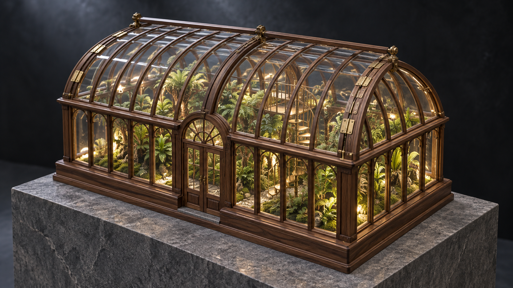

**Réglages image vers vidéo:** 10s · 16:9 · 720p · [Image de départ : ouvrir et enregistrer](assets/unfolding-atrium.png) · [TXT](prompts/text/fr-FR/unfolding-atrium.txt)

```text
Anime la maquette en noyer et laiton en une ouverture mécanique précise de dix secondes. Garde socle de pierre grise, escaliers miniatures et fougères denses. Le toit vitré comporte exactement deux moitiés courbes, articulées sur des axes fixes au faîtage central. Fermés au départ ; l’intérieur se voit déjà à travers le verre.

0–3s: toute la maquette en plan proche de trois quarts. Lumière chaude sur le veinage et les cylindres de charnière. La caméra monte lentement sans interruption, regardant dans l’atrium. Toit fermé un instant ; les rives extérieures se lèvent ensuite, faîtage immobile.

3–7s: les deux moitiés pivotent vers le haut à vitesse identique autour des charnières fixes au faîtage. Les rives extérieures montent, découvrant les plantes ; le faîtage ne se sépare pas. Ouverture contrôlée, courbure et cadres rigides conservés. Monte juste assez pour voir la cage d’escalier ; tout le socle reste cadré.

7–10s: les vantaux ralentissent jusqu’au même angle ouvert et s’arrêtent sans rebond. Tiens sur les fougères et escaliers encadrés par le toit ouvert. Une douce tache de jour pénètre plus loin ; les plantes restent immobiles. Termine sur une structure clairement lisible.

Audio : léger ronronnement d’engrenages lié au toit, deux clics de butée presque simultanés, puis ambiance calme. Ni musique ni voix.

Exactement deux moitiés rigides, axes fixes au faîtage et même intérieur. Rien ne pousse, ne surgit du vide ou ne change d’échelle. Ni panneaux coulissants, verre détaché, métal plié, pièces nouvelles, socle ouvrant, personnes ou coupes.
```

[Retour à l’index des catégories](#find-the-right-prompt)

<a id="case-cobalt-orbit"></a>

<a id="seaimagine-cobalt-orbit"></a>

### 10. Orbite cobalt — étude de mode sur un tour complet

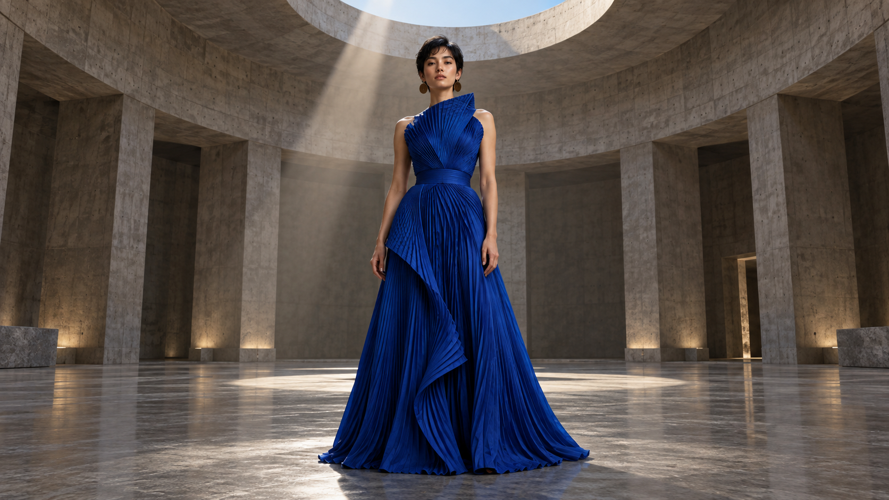

**Réglages image vers vidéo:** 10s · 16:9 · 720p · [Image de départ : ouvrir et enregistrer](assets/cobalt-orbit.png) · [TXT](prompts/text/fr-FR/cobalt-orbit.txt)

```text
Anime la mannequin adulte fictive en un portrait couture en pied de dix secondes. Garde cheveux noirs courts, boucles en disques de cuivre et robe sculpturale plissée bleu cobalt. Préserve salle circulaire en béton nu, verrière zénithale et sol propre. Elle commence face caméra, pieds posés et bras détendus. Cadre de la tête au sol, avec assez d’espace pour la jupe.

0–3s: caméra totalement fixe. Après une brève pause de face, elle tourne lentement dans le sens horaire vu d’en haut, à petits pas maîtrisés sur place. Les épaules guident naturellement ; la jupe lourde suit avec un léger retard. À trois secondes, profil net après un quart de tour.

3–7s: poursuis dans le même sens à une allure calme de défilé. Dos lisible vers cinq secondes, profil opposé vers sept. Elle reste centrée au même endroit. Les plis s’ouvrent et se ferment subtilement autour des jambes ; l’ourlet frôle le sol sans former de disque horizontal. Les boucles oscillent à peine.

7–10s: termine exactement 360 degrés avant neuf secondes, de nouveau face caméra. Les pieds s’arrêtent, puis les derniers plis. Garde la pose frontale la seconde restante, regard serein vers l’objectif.

Audio : pas doux sur béton, froissement discret de tissu et faible ambiance. Ni musique, dialogue ou applaudissements.

Préserve identité, construction de la robe et corps continu plausible sous le vêtement. Tête, mains et ourlet toujours visibles. Direction de lumière et fond fixes. Ni orbite de caméra, tour supplémentaire, coupe, changement de couleur, ourlet volant, accessoires nouveaux ou déformation élastique du corps.
```

[Retour à l’index des catégories](#find-the-right-prompt)

<a id="case-citrus-halo"></a>

<a id="1-citrus-halo--premium-fragrance-product-film"></a>

### 11. Halo d’agrumes : film de parfum haut de gamme


**Réglages image vers vidéo:** 8s · 16:9 · 1080p · [Image de départ : ouvrir et enregistrer](assets/citrus-fragrance-product-video.webp) · [TXT](prompts/text/fr-FR/citrus-halo.txt)

```text
Préservez le design du flacon fourni, les proportions du verre, le bouchon, le socle en calcaire, l’écorce de pamplemousse, le décor ivoire chaud et la lumière latérale dorée. Créez un élégant film de produit de huit secondes.

0–2.5s : commencez par une composition macro presque fixe. La caméra avance très lentement. Les perles de condensation accrochent la lumière ; deux gouttes glissent naturellement sur le verre froid. L’écorce de pamplemousse se soulève du socle comme portée par une brise de studio maîtrisée.

2.5–6s : l’écorce forme une seule spirale gracieuse autour du flacon, sans toucher ni masquer le bouchon. De fines particules de brume d’agrumes traversent le contre-jour. Réfraction et caustiques se déplacent physiquement dans le verre épais ; le flacon reste parfaitement rigide.

6–8s : l’écorce retrouve sa courbe initiale, la caméra s’arrête en douceur et un reflet spéculaire lumineux parcourt une fois le bord du flacon. Terminez sur un plan produit épuré.

Son : uniquement des bruitages de studio proches — léger mouvement du ruban d’écorce, deux gouttes d’eau nettes et délicate résonance de verre. Ni voix, musique ou texte.

Continuité : ne modifiez ni la silhouette du flacon, ni les facettes du bouchon, le niveau du liquide, le socle, la palette ou l’arche du fond. Aucune étiquette, logo, fruit supplémentaire, flacon flottant, géométrie instable, saut de caméra ou explosion artificielle de paillettes.
```

[Retour à l’index des catégories](#find-the-right-prompt)

<a id="seaimagine-browser-workflow"></a>

<a id="create-with-seaimagine"></a>

## Réalisez le plan choisi avec SeaImagine

<a href="https://seaimagine.com/fr/model/grok-imagine-1-5/"></a>

Emportez le plan du flacon, l’échange des horlogers ou le tour en robe cobalt dans Grok Imagine 1.5 sur SeaImagine, avec image de départ et prompt complet. Explorez verre et lumière, les pauses entre deux voix ou le tissu qui suit le corps.

[Verre et lumière](#case-sea-glass-bottle) · [Dialogue d’horlogers](#case-clockwork-dialogue) · [Un tour couture](#case-cobalt-orbit)

[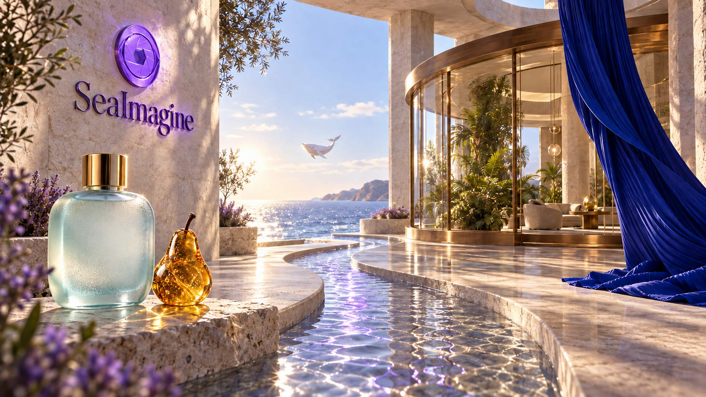](https://seaimagine.com/fr/model/grok-imagine-1-5/)

Verre, tissu sculpté et serre en bord de mer se côtoient dans une même scène fluide.

**[Créer ce plan avec SeaImagine](https://seaimagine.com/fr/model/grok-imagine-1-5/)**

<a id="learn-from-official-and-community-examples"></a>

<a id="writing-guide"></a>

<a id="bibliothèque-complète"></a>

<a id="principes-rapides"></a>

<a id="test-multilingue-partagé--latelier-de-lampe-en-céramique"></a>

## Documentation de référence

[Référence de rédaction](docs/guides/fr-FR.md) · [Référence des réglages et des commandes](docs/workflows/fr-FR.md) · [SeaImagine](https://seaimagine.com/fr/model/grok-imagine-1-5/)

<a id="multilingual-prompts"></a>

## Notes

Les images sont des illustrations conceptuelles ; les prompts originaux n’ont pas encore été testés par génération. Projet maintenu par SeaImagine, sans affiliation à xAI. Les réglages disponibles dépendent de l’outil utilisé.

Sur SeaImagine, choisissez 5/10/15 secondes et 480p/720p, puis ajustez le timing des actions.

[Sources](docs/ATTRIBUTION.md) · [X / YouTube](docs/SOCIAL_INSPIRATION.md) · [Travaux officiels et communautaires](docs/COMMUNITY.md)

[SeaImagine](https://seaimagine.com/fr/model/grok-imagine-1-5/) · [MIT](LICENSE) · [CONTRIBUTING](CONTRIBUTING.md) · [15 languages](docs/LANGUAGES.md)
