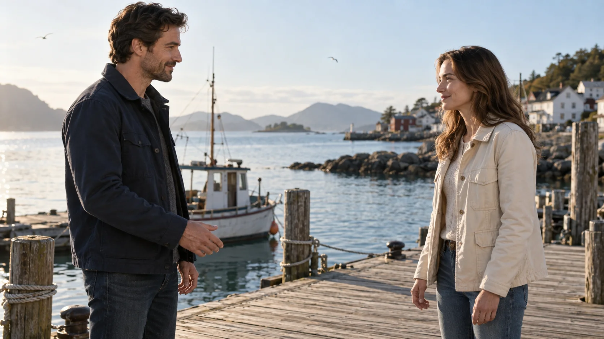
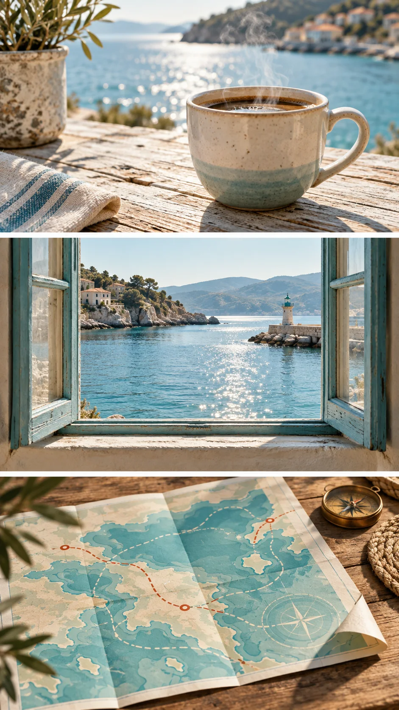
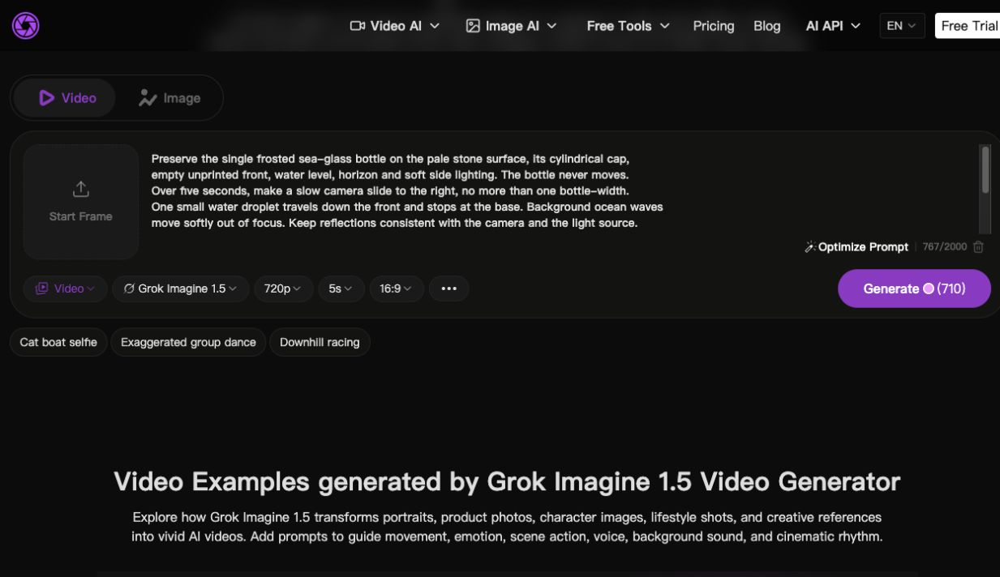

# SeaImagine · Grok Imagine 1.5 — Bahasa Indonesia

[English](README.md) · [简体中文](README.zh-CN.md) · [繁體中文](README.zh-TW.md) · [日本語](README.ja-JP.md) · [한국어](README.ko-KR.md) · [Español](README.es-ES.md) · [Français](README.fr-FR.md) · [Deutsch](README.de-DE.md) · [Português](README.pt-BR.md) · [Italiano](README.it-IT.md) · [Русский](README.ru-RU.md) · [العربية](README.ar.md) · [Bahasa Indonesia](README.id-ID.md) · [ไทย](README.th-TH.md) · [Tiếng Việt](README.vi-VN.md)

> 38 resep berbahasa Inggris: 35 diadaptasi dari Flaq AI dan 3 latihan baru SeaImagine. Panduan dalam 15 bahasa; terjemahan tidak dihitung sebagai adegan baru.


SeaImagine mengadaptasi koleksi Flaq AI dengan mencantumkan sumber. Ini bukan proyek resmi xAI. Gambar konsep bukan hasil Grok yang telah diverifikasi. [Flaq AI](https://github.com/flaqai/awesome-grok-imagine) · [MIT](LICENSE)

## Mulai dengan tiga contoh bergambar SeaImagine

Unduh gambar konsep di bawah atau gunakan gambar sendiri yang sesuai. Tiga latihan baru untuk SeaImagine ini mengikuti pengaturan browser saat ini: 480p atau 720p; 5, 10, atau 15 detik. Gambar tersebut adalah bingkai awal buatan AI, bukan hasil video Grok yang sudah diverifikasi. Ketiga prompt merupakan latihan kreatif yang belum diuji.

Total ada 38 contoh prompt berbahasa Inggris yang berbeda: 35 dari koleksi asli dan 3 latihan baru ini. Terjemahan tidak dihitung sebagai skenario tambahan.

[Bertemu kembali di pelabuhan — satu perubahan emosi](#seaimagine-harbor-reunion) · [Kartu pos pesisir — menggerakkan gambar yang sudah dirancang](#seaimagine-coastal-postcard) · [Botol kaca laut — membandingkan gerakan dengan variabel terkontrol](#seaimagine-sea-glass-bottle)

<a id="seaimagine-harbor-reunion"></a>

### 1. Bertemu kembali di pelabuhan — satu perubahan emosi



[Bingkai awal — buka dan simpan](assets/seaimagine-harbor-reunion.webp)

**Pengaturan gambar ke video:** 10s · 16:9 · 720p

```text
Pertahankan dua orang dewasa, wajah mereka, pakaian biru tua dan krem, dermaga kayu,
dan cahaya pagi lembut dari gambar yang diberikan. Jaga kedua tokoh dalam komposisi medium-wide yang sama.
0–3 detik: orang di sebelah kiri melihat temannya datang dan maju satu langkah kecil.
Bahunya menjadi rileks; temannya membalas dengan senyum tenang. Tangan tetap terlihat dan rileks.
3–7 detik: orang di kiri berkata dalam bahasa Indonesia yang alami, “Kamu datang juga.”
Temannya mengangguk sekali. Ucapkan kalimat dengan tenang, tanpa tangisan atau ekspresi wajah berlebihan.
7–10 detik: keduanya menoleh ke perahu yang tertambat. Tahan detik terakhir agar dapat disambung ke shot berikutnya.
Kamera: satu gerakan maju yang lembut, tanpa reverse shot atau potongan.
Audio: ucapan dekat dan jelas, suara air pelabuhan yang lembut, serta camar dari kejauhan; tanpa musik atau subtitel.
Jaga identitas kedua tokoh, pakaian, bentuk dermaga, posisi perahu, dan arah cahaya pagi tetap sama.
Hindari orang tambahan, gerakan dramatis, penghalusan wajah, jari tambahan, dan lompatan kamera.
```

**Yang perlu diperiksa:** Apakah emosinya terasa tanpa perubahan ekspresi yang besar? Jika dialog terasa terburu-buru, hapus langkah maju sebelum menambah durasi. Untuk film yang lebih panjang, tulis shot berikutnya secara terpisah.

<a id="seaimagine-coastal-postcard"></a>

### 2. Kartu pos pesisir — menggerakkan gambar yang sudah dirancang

<a href="assets/seaimagine-coastal-postcard.webp"></a>

[Bingkai awal — buka dan simpan](assets/seaimagine-coastal-postcard.webp)

**Pengaturan gambar ke video:** 5s · 9:16 · 720p

```text
Animasikan kartu pos pesisir tiga panel ini tanpa mengubah tata letak atau batas panel.
Pertahankan semua objek dan warna secara persis. Di panel atas, satu sulur uap tipis naik dari cangkir.
Di panel tengah, air pelabuhan beriak pelan dan sinar matahari berkilau di permukaannya.
Di panel bawah, hanya sudut kertas yang sudah ada yang terangkat sedikit lalu turun karena angin sepoi-sepoi.
Jaga setiap gerakan tetap di dalam panelnya sendiri. Semua panel tetap terlihat sepanjang lima detik.
Kamera: diam, tanpa zoom, pan, potongan, atau transisi antar panel.
Audio: suara air yang tenang dan gemerisik kertas lembut; tanpa dialog, musik, takarir, atau teks tambahan.
Pertahankan gagang cangkir, bingkai jendela, tanda pada peta, ukuran panel, dan urutan baca.
Hindari penggabungan panel, penciptaan adegan baru, penggambaran ulang huruf, atau perpindahan objek melewati batas panel.
Akhiri dengan sudut kertas yang sudah turun dan komposisi asli tetap utuh.
```

**Yang perlu diperiksa:** Jika batas panel meleleh atau adegan bercampur, potong setiap panel dan animasikan secara terpisah, lalu gabungkan klip dengan aplikasi penyunting video.

<a id="seaimagine-sea-glass-bottle"></a>

### 3. Botol kaca laut — membandingkan gerakan dengan variabel terkontrol


[Bingkai awal — buka dan simpan](assets/seaimagine-sea-glass-bottle.webp)

**Pengaturan gambar ke video:** 5s · 16:9 · 720p

```text
Pertahankan satu botol kaca laut buram di atas permukaan batu berwarna pucat, tutup silindernya,
sisi depan kosong tanpa cetakan, tinggi cairan, garis cakrawala, dan pencahayaan samping yang lembut.
Botol tidak pernah bergerak. Selama lima detik, geser kamera perlahan ke kanan, tidak lebih dari selebar satu botol.
Satu tetes air kecil mengalir turun di sisi depan dan berhenti di dasar botol.
Ombak laut di latar belakang bergerak pelan dalam keadaan tidak fokus.
Jaga pantulan tetap sesuai dengan posisi kamera dan sumber cahaya.
Audio: hanya debur ombak dari kejauhan; tanpa musik, suara manusia, benturan kaca, atau percikan berlebihan.
Tanpa potongan atau zoom. Pertahankan siluet botol, posisi tutup, tekstur kaca, dan jumlah objek.
Hindari munculnya logo, perubahan tinggi cairan, tepi yang melengkung, objek melayang, atau properti baru.
Tahan bingkai yang stabil pada detik terakhir.
```

**Yang perlu diperiksa:** Catat model yang benar-benar digunakan, durasi, resolusi, jumlah percobaan, dan tanggal. Bandingkan bentuk botol, kesinambungan tetes air, pantulan, dan gerakan kamera. Satu klip yang berhasil belum membuktikan keandalan.

<a id="seaimagine-browser-workflow"></a>

## Gunakan kontrol yang benar-benar tersedia di SeaImagine

[SeaImagine · Grok Imagine 1.5](https://seaimagine.com/id/model/grok-imagine-1-5/)

Tangkapan layar menampilkan antarmuka berbahasa Inggris yang diperiksa pada 24 September 2026. Teks dalam bahasa lain mungkin berbeda; posisi dan langkah di bawah membantu Anda menemukan setiap kontrol. Pada tangkapan layar, prompt botol sudah diisi dan 720p / 5s / 16:9 sudah dipilih; Start Frame (bingkai awal) masih kosong. Unggah gambar awal sebelum membuat video. Tidak ada tugas yang dikirim.



1. Buka halaman model yang ditautkan. Pilih Video dan pastikan Grok Imagine 1.5 terpilih pada pemilih model.
2. Gunakan Start Frame (bingkai awal) di sebelah kiri untuk mengunggah gambar yang telah diunduh. Tempelkan prompt lengkap ke kolom teks besar; batas saat ini adalah 2.000 karakter.
3. Di bawah prompt, pilih resolusi (480p atau 720p), durasi (5s, 10s, atau 15s), dan rasio. Untuk botol: 720p, 5s, 16:9.
4. Periksa jumlah kredit di sebelah Generate (buat); jumlahnya berubah mengikuti pengaturan. Generate mengirim tugas sungguhan dan mungkin memerlukan login atau kredit. Tangkapan layar tersebut bukan hasil pembuatan yang sudah selesai.
5. Pratinjau hasil, periksa kemungkinan masalah yang disebutkan, lalu unduh jika memuaskan. Jika contoh lama meminta 6/8/9/12 detik atau 1080p, pilih durasi yang tersedia dan tulis ulang rentang waktunya; gunakan 720p, jangan berasumsi 1080p tersedia.

<a id="learn-from-official-and-community-examples"></a>

## Belajar dari karya resmi dan komunitas

Postingan sumber mencantumkan pembuat dan versi model. Buka postingan asli untuk menonton. Catatan praktis di bawah membahas metode, bukan klaim bahwa kami telah mereproduksi videonya.

Pada 24 September 2026, kami memeriksa beberapa bingkai melalui pemutar di postingan X asli: klip resmi sekitar 3,6 detik (helm dan pasukan), 19,8 detik (wajah dari dekat), dan 34,6 detik (kota tepi air yang terbakar); video GENEL sekitar 0,05 detik (pagar tepi laut), 4,9 detik (perlintasan kereta), dan 12 detik (tangan dengan cahaya dari belakang). Pelajari pergantian ukuran shot dalam klip resmi serta cahaya pesisir yang konsisten di berbagai shot GENEL. Kartu pos kami dengan panel tetap merupakan latihan yang berbeda. Pemeriksaan ini hanya mengambil sampel bingkai, bukan pengujian gerakan atau audio secara menyeluruh.

### [Cuplikan resmi 1.5 Preview — Grok / Heavy Pulp](https://x.com/grok/status/2062225080843747351)

[](https://x.com/grok/status/2062225080843747351)

Pelajari cara merencanakan trailer sebagai rangkaian shot pendek yang terpisah. Bedakan rekaman Preview dari model 1.5 yang sudah dirilis.

### [Film pendek yang sudah selesai — JSFILMZ](https://x.com/JSFILMZ0412/status/2062480692835938771)

Pembuatnya menyatakan telah membuat film berdurasi 2,5 menit dan membahas keterbatasan akting hasil generasi. Latih satu percakapan yang tenang terlebih dahulu; susun cerita yang lebih panjang dari shot yang diedit.

### [Merancang gambar sebelum animasi — GENEL](https://x.com/genel_ai/status/2061382998873034825)

[](https://x.com/genel_ai/status/2061382998873034825)

Pembuatnya menyatakan telah membuat kolase dengan ChatGPT Images 2.0, lalu menganimasikannya memakai Grok Imagine Video 1.5. Latihan kartu pos kami mempertahankan batas panel dan memberi hanya satu gerakan pada tiap panel.

### [Perbandingan terkontrol — JSFILMZ](https://x.com/JSFILMZ0412/status/2061117682515050669)

Gunakan satu gambar sumber dan pengaturan yang sebanding. Periksa bentuk, gerakan, dan audio, alih-alih menyalin peringkat lama. Latihan botol kami memisahkan variabel tersebut agar dapat diperiksa.

[Sumber dan catatan penayangan (bahasa Inggris)](docs/COMMUNITY.md)

## Contoh lainnya dan koleksi asli dengan keterangan sumber tersedia di bawah

Arsip di bawah mempertahankan prompt asli dan parameter untuk API (antarmuka pemrograman aplikasi). Untuk SeaImagine, sesuaikan dengan kontrol di atas: 5/10/15 detik dan 480p/720p. Tulis ulang gerakan yang diberi rentang waktu agar sesuai dengan durasi; penyuntingan dan perpanjangan video memerlukan alur kerja tersendiri yang mendukung fungsi tersebut.


## Aturan cepat

- Untuk klip 1–15 detik, utamakan satu aksi utama dan satu gerakan kamera yang jelas.
- Pada image-to-video, kunci identitas, bentuk produk, material, cahaya, dan komposisi terlebih dahulu.
- Tulis dialog Bahasa Indonesia secara persis serta sebutkan ragam, tempo, jeda, dan prioritas campuran suara.
- Berikan satu tugas untuk setiap referensi: identitas, pakaian, produk, lokasi, atau suara.
- Buat satu detik terakhir stabil agar mudah disunting atau diperpanjang.

## Uji multibahasa bersama: bengkel lampu keramik

**Mode:** image-to-video · **Keluaran:** 8 detik · 16:9 · 720p

```text
Pertahankan perajin dewasa fiktif, wajah, tangan, celemek nila, lampu keramik berlubang yang orisinal,
alat kayu, rak bengkel, komposisi, dan cahaya samping hangat dari gambar sumber. Jangan mengubah
siluet, jumlah, atau susunan lubang kecil pada lampu.

0–3 detik: kamera maju perlahan sekitar lima sentimeter. Perajin menahan dasar lampu dengan tangan
kiri dan menyapukan kuas lembut yang sudah ada satu kali di permukaan; debu tanah liat halus turun
secara alami di dalam cahaya samping. 3–6 detik: ia memutar kenop peredup yang ada satu kali. Cahaya
hangat muncul perlahan melalui lubang asli. Dengan Bahasa Indonesia alami, ia berkata, “Lubang-lubang
kecil membuat cahayanya lebih lembut.” 6–8 detik: ia meletakkan kuas, memandang lampu, dan kamera
berhenti. Pertahankan detik terakhir tetap stabil.

Audio: kuas pada keramik, klik kenop, suasana bengkel yang tenang, dan suara Indonesia jarak dekat.
Tanpa musik atau teks terjemahan.

Kontinuitas: identitas, tangan, celemek, bentuk dan lubang lampu, alat, rak, dan arah cahaya. Hindari
jari tambahan, desain ulang lampu, lubang baru, wajah berubah, teks palsu, logo, potongan kamera,
atau cahaya berlebihan.
```

## Pustaka lengkap

- [Iklan dan produk](prompts/01-ads-and-products.md)
- [Penceritaan sinematik](prompts/02-cinematic-storytelling.md)
- [Sosial, UGC, dan gaya hidup](prompts/03-social-ugc.md)
- [Karakter dan referensi](prompts/04-characters-and-references.md)
- [Penyuntingan dan perpanjangan](prompts/05-editing-and-extension.md)

## Buat dengan SeaImagine

[Grok Imagine 1.5 · SeaImagine](https://seaimagine.com/id/model/grok-imagine-1-5/)

Unggah gambar awal, tempel prompt gerakan, lalu pilih pengaturan yang tersedia. Periksa wajah, tangan, bentuk produk, dan suara sebelum mengunduh.

[SeaImagine](docs/SEAIMAGINE.md) · [xAI](docs/OFFICIAL.md) · [X / Community](docs/COMMUNITY.md) · [15 languages](docs/LANGUAGES.md)
